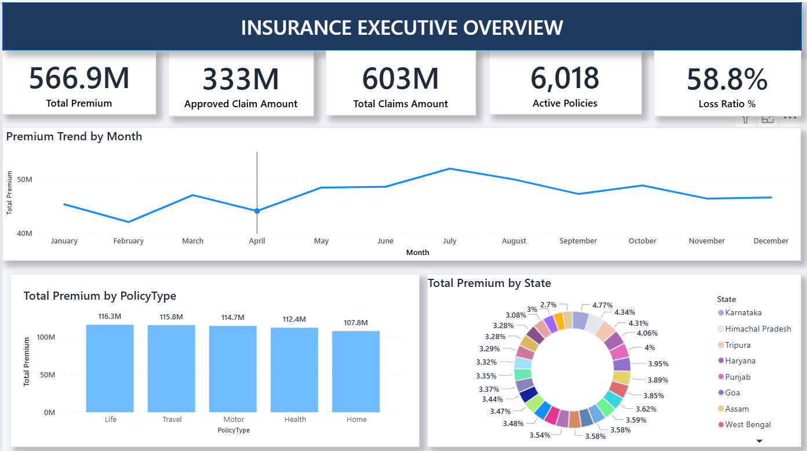

# Insurance Executive Overview Dashboard

## Project Overview

This Power BI dashboard provides an executive-level overview of insurance business performance using key KPIs and interactive visualizations.

## Tools Used

* Power BI
* DAX
* Power Query
* Microsoft Excel

## Key KPIs

* Total Premium: 566.9M
* Total Claims Amount: 603M
* Approved Claim Amount: 333M
* Active Policies: 6,018
* Loss Ratio: 58.8%

## Dashboard Features

* Monthly Premium Trend Analysis
* Premium Distribution by State
* Premium Analysis by Policy Type
* Interactive KPI Cards
* Custom DAX Measures
* Business Performance Monitoring

## Skills Demonstrated

* Data Cleaning
* Data Modeling
* DAX Calculations
* KPI Design
* Dashboard Development
* Business Intelligence Reporting

## Dashboard Preview

## Project Files

* Exe overview up.pbix
* Dashboard_Screenshot.png

